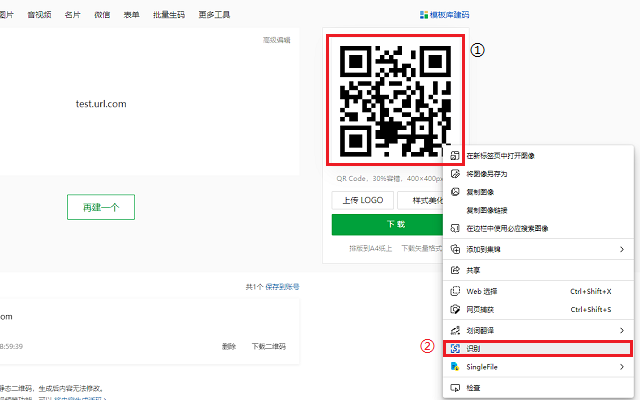
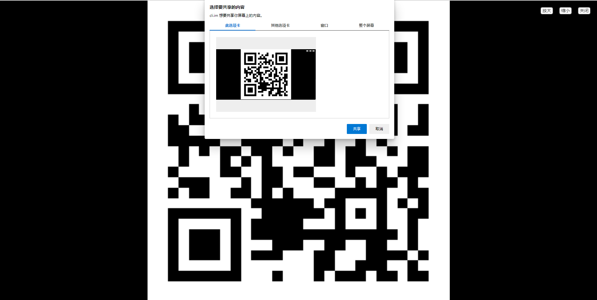
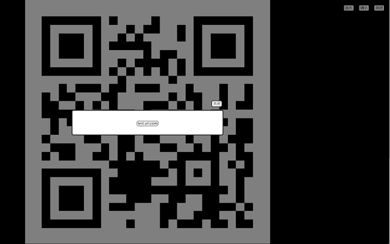

# qrcode_to_url
将网页中的二维码图片转化为链接，省去了拿出手机微信扫码再上传到电脑的过程。基于[zxing](https://github.com/zxing-js/library)提供的二维码识别库进行开发。使用[browsify](https://github.com/browserify/browserify)打包zxing的API使得在浏览器上能够使用。

## 特点
1. 全程本地实现，不会上传任何信息到服务器。
2. 使用屏幕录制功能完成二维码图片的像素值获取，没有跨域风险。
3. 提供简易二维码图像阅读器，可以调整大小和位置，便于更好的识别二维码。

## 使用方法
0. ~~安装本扩展~~

1. 在包含二维码的网页中，右键单击二维码图像，选择本扩展提供的选项“识别”。

2. 然后会启动一个建议的图像查看器，如果是很长的图像中包含二维码，可以通过放大和滚动调整二维码的的位置，使其位于屏幕中央。

3. 点击扩展工具栏中，本扩展的图标，将会发起识别流程
    1. 提示共享屏幕，点击当前屏幕，点击允许

    2. 自动截图并识别二维码，将链接显示在弹窗中

## Chrome商店链接
[待审核](javascript:void())
